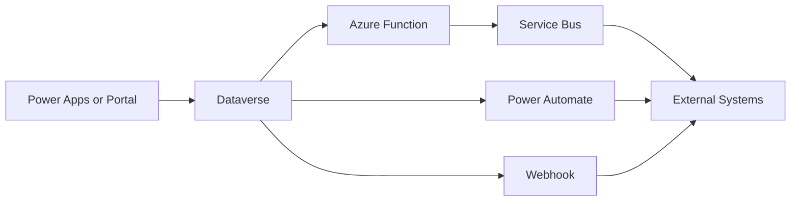

# Power Platform Integration Patterns

Practical integration patterns for connecting **Microsoft Power Platform**, **Dynamics 365**, and **Dataverse** with external systems.

This repository focuses on architectural patterns commonly used in enterprise and government environments where Power Platform solutions must integrate with existing systems and cloud services.

## Reference Integration Landscape



This repo is organised around the main decisions in that flow: when to call directly, when to trigger asynchronously, and when to introduce messaging or a dedicated integration layer.

## Contents

- [Architecture Principles](architecture-principles.md)
- [Dataverse Integration](dataverse-integration.md)
- [Azure Functions](azure-functions.md)
- [Service Bus](service-bus.md)
- [Webhooks](webhooks.md)
- [API Integration](api-integration.md)
- [Event Driven Patterns](event-driven-patterns.md)

## Suggested Reading Path

If you are deciding which pattern to use, start with [Architecture Principles](architecture-principles.md), then move to [Dataverse Integration](dataverse-integration.md), and then choose the implementation style that best fits the requirement:

- [API Integration](api-integration.md) for direct service calls
- [Webhooks](webhooks.md) for lightweight synchronous notifications
- [Azure Functions](azure-functions.md) for integration logic and transformation
- [Service Bus](service-bus.md) and [Event Driven Patterns](event-driven-patterns.md) for resilient asynchronous processing

## Why Integration Patterns Matter

Power Platform solutions rarely exist in isolation. In real systems they often interact with:

- legacy enterprise systems
- government platforms
- external APIs
- messaging infrastructure
- Azure-based services

Well-designed integration patterns help ensure solutions are:

- secure
- maintainable
- scalable
- observable
- resilient

## Typical Integration Scenarios

Common scenarios include:

- sending events from Dataverse to external systems
- processing asynchronous workloads
- integrating portal applications with backend services
- triggering workflows from external APIs
- synchronising data between enterprise platforms
- event-driven processing using Azure messaging services

## Example Event Envelope

Many of the patterns in this repo work better when teams standardise on a simple event contract:

```json
{
	"eventType": "account.updated",
	"source": "dataverse",
	"entityName": "account",
	"recordId": "9b1d2c0f-1234-4c7d-98a0-123456789abc",
	"occurredOn": "2026-03-17T09:42:00Z",
	"correlationId": "6dd3f520-f4c3-4bc3-a6a3-2ac6fd31d1bb"
}
```

Using a predictable envelope makes retries, observability, and downstream routing much easier.

## Technology Areas Covered

This repo includes patterns involving:

- Dataverse Web API
- Power Automate
- Azure Functions
- Azure Service Bus
- REST APIs
- event-driven architectures

## Who This Is For

- Dynamics 365 developers
- Power Platform developers
- integration developers
- solution architects
- teams building enterprise Power Platform solutions

## Author

Maintained by Matthew Brunsdon.