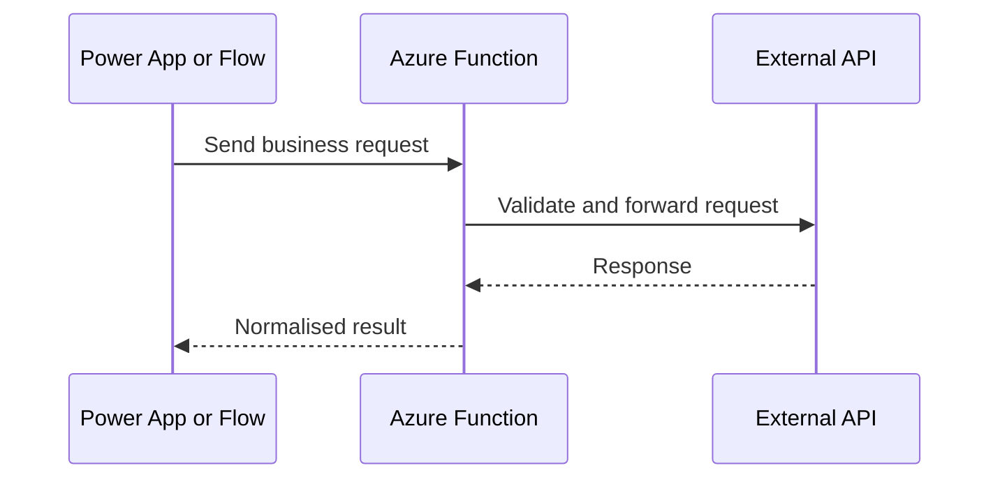

# API Integration

Power Platform frequently integrates with external REST APIs.

## Typical API Mediation Flow



## Common Scenarios

- retrieving external data
- sending updates to external systems
- orchestrating workflows across platforms
- exposing services to portals

## Integration Options

- Power Automate connectors
- Azure Functions acting as API gateways
- direct API calls from integration services
- middleware platforms

## Good API Practices

- validate inputs and outputs
- design for retries
- implement authentication securely
- log requests and failures
- version APIs carefully

## Example API Request Contract

```json
{
  "customerId": "ACC-10045",
  "status": "Active",
  "changedOn": "2026-03-17T09:54:00Z",
  "source": "dataverse"
}
```

## Avoid Tight Coupling

Do not tightly couple portal UI or plugins directly to external APIs if reliability is uncertain.

Use intermediate services where possible.

## Example HTTP Integration Function

```csharp
public sealed class CustomerSyncFunction
{
	private readonly HttpClient _httpClient;

	public CustomerSyncFunction(IHttpClientFactory httpClientFactory)
	{
		_httpClient = httpClientFactory.CreateClient("ExternalCrm");
	}

	[Function("CustomerSync")]
	public async Task<HttpResponseData> Run(
		[HttpTrigger(AuthorizationLevel.Function, "post")] HttpRequestData request)
	{
		var payload = await JsonSerializer.DeserializeAsync<CustomerUpdate>(request.Body);
		using var response = await _httpClient.PostAsJsonAsync("/customers/sync", payload);

		var output = request.CreateResponse(response.StatusCode);
		await output.WriteStringAsync(await response.Content.ReadAsStringAsync());
		return output;
	}
}
```

This pattern keeps authentication, retry policy, payload validation, and error mapping out of the app or workflow itself.

## Related Pages

- [Azure Functions](azure-functions.md) for the integration-hosting model behind this pattern
- [Dataverse Integration](dataverse-integration.md) for when direct Web API access is a better fit
- [Webhooks](webhooks.md) for lightweight trigger-based alternatives