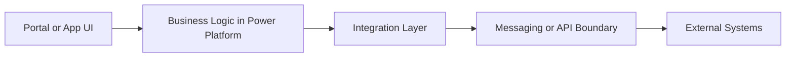

# Architecture Principles

When integrating Power Platform with external systems, clear architectural principles help avoid fragile or tightly coupled solutions.

## Recommended Separation



The goal is simple: keep business interactions close to Power Platform, and push cross-system integration concerns into services that can be monitored, retried, and evolved independently.

## Prefer Asynchronous Integration

Whenever possible:

- send events
- process messages
- avoid synchronous dependencies

This improves resilience and scalability.

## Avoid Direct Database Access

External systems should interact with Dataverse through:

- Web API
- approved integration services
- event-driven patterns

Direct database access breaks the application model and risks data integrity.

## Keep Power Platform Focused on Business Logic

Power Platform works best when used for:

- business data
- business processes
- user interaction

Heavy integration logic should often be handled by Azure services.

## Separate Integration Concerns

Avoid mixing responsibilities across layers:

- portal UI
- Power Automate
- plugin logic
- external services

Define clear boundaries.

## Design for Observability

Integration architectures should include:

- logging
- failure tracking
- retry mechanisms
- monitoring

Without observability, troubleshooting becomes extremely difficult.

## Consider Security Early

Integration architecture must consider:

- authentication models
- API security
- least privilege access
- auditability
- data exposure

Security retrofits are expensive and risky.

## Think About Ownership

Integration questions to clarify early:

- which system owns the data?
- which system initiates updates?
- what happens when systems disagree?
- what should happen during outages?

## Review Checklist Example

```csharp
var integrationReview = new
{
	SystemOfRecord = "dataverse",
	InvocationModel = "asynchronous",
	RetryStrategy = "exponential-backoff",
	IdempotencyKey = "correlationId",
	AuditLogging = true,
	SecretsStoredIn = "key-vault"
};
```

That kind of lightweight checklist helps teams make architectural decisions explicit before implementation starts.

## Related Pages

- [Dataverse Integration](dataverse-integration.md) for choosing the right Dataverse boundary
- [API Integration](api-integration.md) for direct service-to-service patterns
- [Event Driven Patterns](event-driven-patterns.md) for resilient asynchronous design