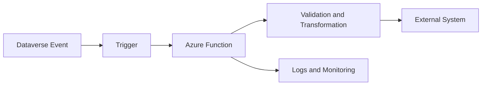

# Azure Functions

Azure Functions are often used as a lightweight integration layer between Power Platform and external systems.

## Function-Centred Integration Flow



## Common Use Cases

- processing Dataverse events
- exposing custom APIs
- transforming data
- integrating with external services
- processing messages from queues

## Typical Architecture

Example flow:

1. Dataverse change occurs
2. event triggers workflow or webhook
3. Azure Function processes event
4. external system updated

Azure Functions can also be triggered by:

- HTTP requests
- Service Bus messages
- timers
- storage events

## Design Considerations

When designing Azure Function integrations:

- validate input data
- implement retry logic
- design idempotent processing
- log important operations
- protect secrets and credentials

## Advantages

Azure Functions provide:

- serverless scaling
- flexible integration options
- language flexibility
- easy integration with Azure services

They work well as the "glue" between Power Platform and enterprise systems.

## Example Service Bus Trigger Function

```csharp
public sealed class OrderCreatedHandler
{
	private readonly ILogger<OrderCreatedHandler> _logger;

	public OrderCreatedHandler(ILogger<OrderCreatedHandler> logger)
	{
		_logger = logger;
	}

	[Function("OrderCreatedHandler")]
	public Task Run(
		[ServiceBusTrigger("orders-created", Connection = "ServiceBusConnection")]
		string message)
	{
		_logger.LogInformation("Processing order event: {Message}", message);
		return Task.CompletedTask;
	}
}
```

For production use, pair this with idempotency checks, structured logging, and poison message handling.

## Related Pages

- [Service Bus](service-bus.md) for the messaging backbone often paired with Functions
- [API Integration](api-integration.md) for HTTP-mediated integration patterns
- [Webhooks](webhooks.md) for synchronous event entry points