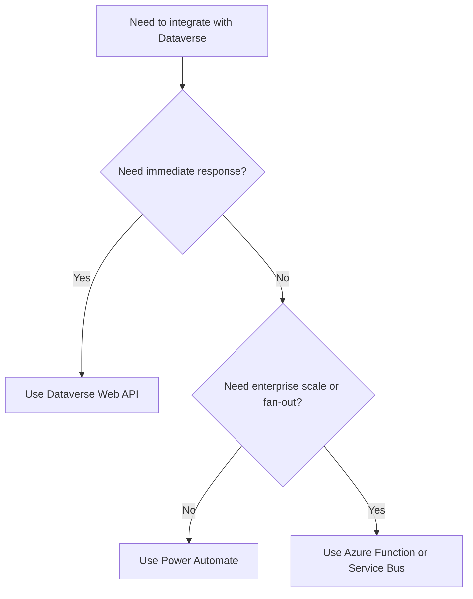

# Dataverse Integration

Dataverse can be integrated with external systems using several approaches.

## Integration Decision Map



## Common Integration Options

- Dataverse Web API
- Power Automate
- plugins triggering external services
- Azure Functions
- messaging platforms such as Service Bus

## When to Use Web API

Web API is suitable for:

- CRUD operations
- synchronous integrations
- external system access
- administrative operations
- automation scripts

## When to Use Power Automate

Power Automate is often useful for:

- event-driven automation
- simple integration scenarios
- Microsoft ecosystem workflows
- low-volume event processing

## When to Use Azure Integration

Azure-based integration services are useful when:

- processing large volumes
- integrating multiple systems
- building resilient message-based workflows
- implementing event-driven architecture

## Practical Advice

Think carefully about:

- transaction boundaries
- retry behaviour
- data ownership
- error handling
- monitoring

Avoid building integration logic that depends on fragile synchronous workflows.

## Example Dataverse Web API Call

```csharp
using System.Net.Http.Headers;

var request = new HttpRequestMessage(
	HttpMethod.Get,
	"https://org.crm.dynamics.com/api/data/v9.2/accounts?$select=name,accountnumber&$top=5");

request.Headers.Authorization = new AuthenticationHeaderValue("Bearer", accessToken);
request.Headers.Accept.Add(new MediaTypeWithQualityHeaderValue("application/json"));

using var response = await httpClient.SendAsync(request);
response.EnsureSuccessStatusCode();

var content = await response.Content.ReadAsStringAsync();
```

## Example Contact Query in C#

```csharp
var uri = "https://org.crm.dynamics.com/api/data/v9.2/contacts?$select=fullname,emailaddress1";
var contacts = await httpClient.GetFromJsonAsync<JsonElement>(uri);
```

These examples are intentionally simple, but they highlight the contract boundary that external systems should use instead of attempting unsupported database access.

## Related Pages

- [API Integration](api-integration.md) for patterns that call external APIs from a managed boundary
- [Azure Functions](azure-functions.md) for scaling integration logic beyond direct calls
- [Service Bus](service-bus.md) for asynchronous Dataverse-driven workloads