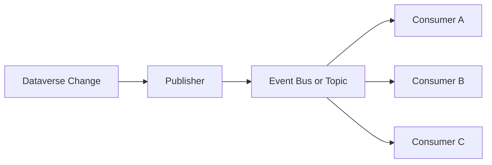

# Event Driven Patterns

Event-driven architecture is increasingly common in Power Platform integrations.

## Event-Driven Topology



## What Is Event Driven Architecture

Systems publish events when something happens.

Other systems react to those events.

This avoids tight coupling.

## Example Event Flow

1. record created in Dataverse
2. event published
3. integration service receives event
4. downstream systems process independently

## Benefits

Event-driven approaches provide:

- scalability
- resilience
- system independence
- easier evolution of integrations

## Common Technologies

Typical components include:

- Azure Service Bus
- event processing services
- integration microservices
- logging and monitoring systems

## Design Advice

Design events carefully:

- define clear event types
- include meaningful identifiers
- keep payloads manageable
- design consumers to tolerate duplicates

## Example Event Payload

```json
{
	"eventType": "contact.created",
	"entityName": "contact",
	"recordId": "6d3f7410-3f35-4c6d-b4cb-4cb5d00cd5f0",
	"occurredOn": "2026-03-17T10:05:00Z",
	"correlationId": "26c8f88e-bd73-45d7-a3c6-74d493d81b6f",
	"data": {
		"firstName": "Adele",
		"lastName": "Vance"
	}
}
```

Consumers should treat the payload as immutable history, not as a command to re-query and guess what changed later.

## Related Pages

- [Service Bus](service-bus.md) for a concrete implementation of message-based delivery
- [Azure Functions](azure-functions.md) for event consumers and processors
- [Architecture Principles](architecture-principles.md) for the rationale behind asynchronous design