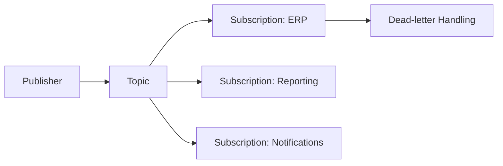

# Service Bus

Azure Service Bus enables reliable asynchronous communication between systems.

## Queue and Topic Pattern



## Why Messaging Is Useful

Messaging decouples systems so that:

- producers do not depend on consumers
- workloads can scale independently
- temporary failures do not break workflows

## Typical Pattern

1. event occurs in Dataverse
2. message is published
3. one or more consumers process the message

This allows multiple downstream systems to respond independently.

## Common Messaging Components

- queues
- topics
- subscriptions
- dead letter queues

## Benefits

Using messaging provides:

- resilience
- scalability
- separation of concerns
- improved fault tolerance

## Practical Advice

Design messages carefully:

- include meaningful identifiers
- include timestamps
- avoid unnecessary payload size
- design consumers to handle retries

## Example Message Contract

```json
{
	"messageType": "invoice.approved",
	"messageId": "21f30fa4-9027-4a96-8c3a-7fb9e7c7c42f",
	"correlationId": "9914b85f-a42c-4d44-83ae-7eb5a6b4db52",
	"occurredOn": "2026-03-17T10:18:00Z",
	"payload": {
		"invoiceId": "INV-10042",
		"amount": 1250.00,
		"currency": "GBP"
	}
}
```

## Example Consumer Skeleton

```csharp
[Function("InvoiceApprovedHandler")]
public async Task Run(
		[ServiceBusTrigger("invoice-events", "finance", Connection = "ServiceBusConnection")]
		string message)
{
		var envelope = JsonSerializer.Deserialize<MessageEnvelope>(message);
		await _invoiceService.ProcessAsync(envelope!);
}
```

The important design point is not the code itself. It is that the contract carries enough metadata for tracing, retries, and deduplication.

## Related Pages

- [Event Driven Patterns](event-driven-patterns.md) for the architectural model behind topics and subscriptions
- [Azure Functions](azure-functions.md) for common consumer implementations
- [Webhooks](webhooks.md) for synchronous ingress patterns that often publish to Service Bus