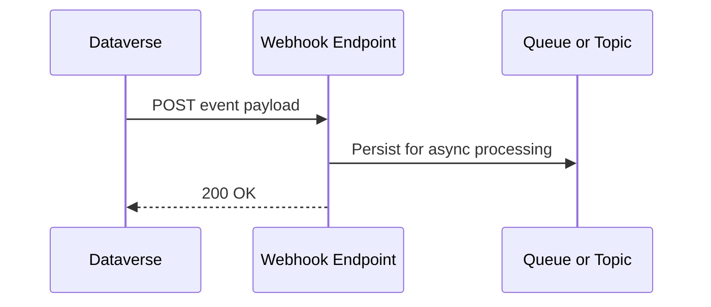

# Webhooks

Webhooks allow Dataverse to notify external systems when events occur.

## Webhook Delivery Flow



## Common Uses

- notifying external services of record changes
- triggering downstream processes
- integrating with integration middleware

## Typical Flow

1. record created or updated
2. webhook triggered
3. external service receives payload
4. service processes event

## Important Considerations

- webhooks are synchronous
- failures may affect transaction behaviour
- payload size and complexity should be controlled
- receiving services must respond quickly

## When To Use

Webhooks are suitable for:

- simple integration triggers
- notifying integration middleware
- lightweight event handling

For complex integration logic, queue-based patterns are often safer.

## Example Webhook Receiver

```csharp
public sealed class DataverseWebhookReceiver
{
	private readonly ServiceBusSender _sender;

	public DataverseWebhookReceiver(ServiceBusClient serviceBusClient)
	{
		_sender = serviceBusClient.CreateSender("dataverse-events");
	}

	[Function("DataverseWebhookReceiver")]
	public async Task<HttpResponseData> Run(
		[HttpTrigger(AuthorizationLevel.Function, "post")] HttpRequestData request)
	{
		var payload = await new StreamReader(request.Body).ReadToEndAsync();
		await _sender.SendMessageAsync(new ServiceBusMessage(payload)
		{
			ContentType = "application/json"
		});

		var response = request.CreateResponse(HttpStatusCode.OK);
		await response.WriteStringAsync("accepted");
		return response;
	}
}
```

The key operational rule is to acknowledge quickly and move heavier processing out of the synchronous request path.

## Related Pages

- [Service Bus](service-bus.md) for the queue or topic layer commonly used behind webhook receivers
- [Azure Functions](azure-functions.md) for the hosting model used in the example above
- [Event Driven Patterns](event-driven-patterns.md) for the asynchronous processing style webhooks often feed into